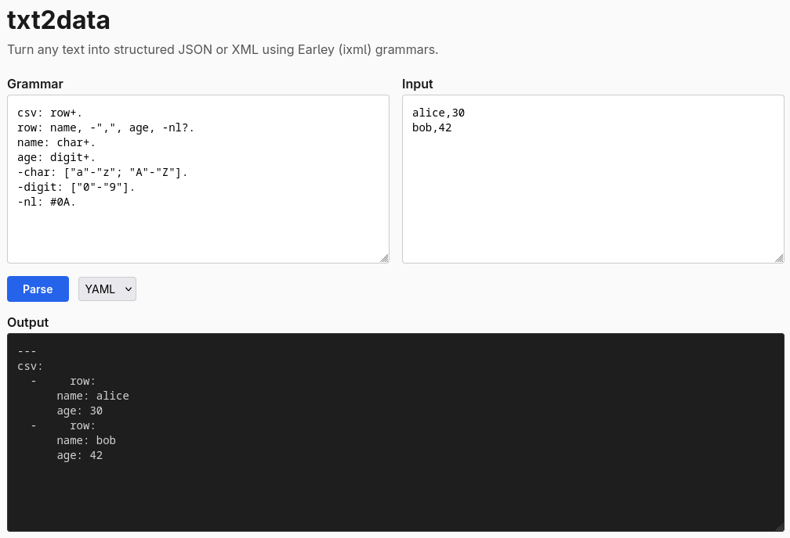
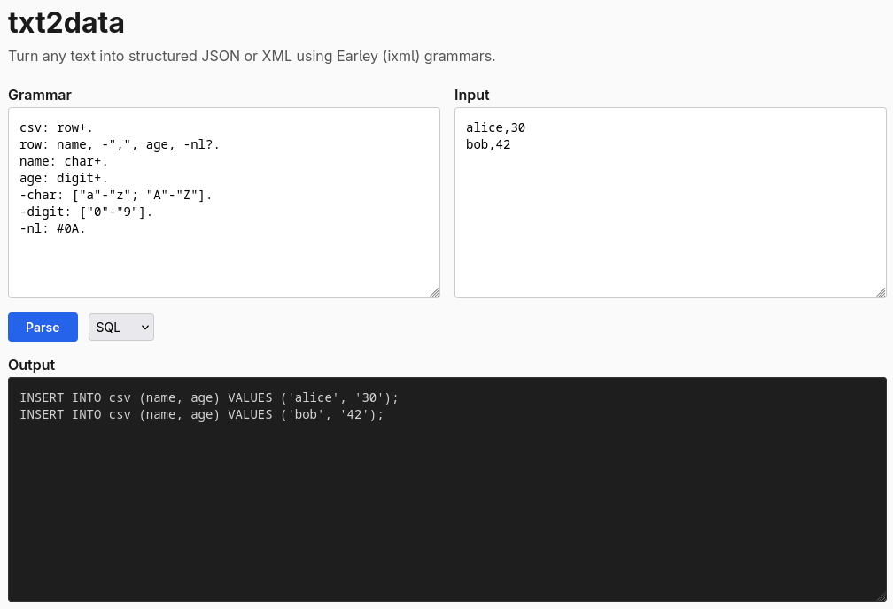

# txt2data

Describe your text format with a grammar. Get back JSON, XML, YAML, or SQL.


```sh
printf 'alice,30' | txt2data -e '
  row: name, -",", age.
  name: char+.
  age: digit+.
  -char: ["a"-"z"].
  -digit: ["0"-"9"].
'
```

```json
{ "name": { "#text": "alice" }, "age": { "#text": "30" } }
```

No code generation, no build step -- just a grammar and your input.

## Install

```sh
cargo install txt2data
```

From source:

```sh
git clone https://github.com/rh-jfuller/txt2data && cd txt2data
make release && make install
```

## Usage

```sh
# inline grammar, stdin input
printf 'foo=bar' | txt2data -e 'pair: key, -"=", value. key: ["a"-"z"]+. value: ["a"-"z"]+.'

# grammar file, input file
txt2data -g format.ixml -i data.txt

# XML output
txt2data -g format.ixml -i data.txt -f xml
```

### As a library

```rust
use txt2data::parse_to_json;

let grammar = r#"
    row: name, -",", age.
    name: ["a"-"z"]+.
    age:  ["0"-"9"]+.
"#;

let json = parse_to_json(grammar, "alice,30").unwrap();
```

## Grammar

Rules are `name: definition.` -- a name, colon, body, period.

| Syntax          | Meaning                         |
|-----------------|---------------------------------|
| `"text"`        | Literal                         |
| `["a"-"z"]`     | Character range                 |
| `["abc"]`       | Character set                   |
| `[Ll]`          | Unicode category                |
| `~[" "]`        | Exclusion (anything except)     |
| `a, b`          | Sequence                        |
| `a; b`          | Alternative                     |
| `x+`            | One or more                     |
| `x*`            | Zero or more                    |
| `x?`            | Optional                        |
| `-x`            | Hidden (match but omit)         |
| `@x`            | Attribute (flat string)         |
| `+"text"`       | Insertion (output only)         |
| `#0A`           | Hex codepoint                   |

### Marks

Marks control output shape:

- No mark -- nested object (JSON) or element (XML)
- `-` -- matched but hidden; children promoted up
- `@` -- flat string property / XML attribute
- `^` -- explicitly an element

```sh
printf 'width:100px' | txt2data -e '
  decl: @prop, -":", @val.
  @prop: ["a"-"z"]+.
  @val: ["a"-"z"; "0"-"9"]+.
'
```

```json
{ "@prop": "width", "@val": "100px" }
```

## CLI reference

```
txt2data [OPTIONS]

  -g, --grammar <FILE>    Grammar file
  -e, --expr <GRAMMAR>    Inline grammar
  -i, --input <FILE>      Input file (default: stdin)
  -f, --format <FORMAT>   json (default), xml, yaml, sql
  -h, --help
  -V, --version
```

## Examples

See [`etc/`](etc/) for grammar + input pairs: CSV, key-value, dates,
HTTP requests, attribute marks. Run them all:

```sh
make examples
```

### CSV (multi-row)

```
csv: row+.
row: name, -",", age, -nl?.
name: ["a"-"z"]+.
age: ["0"-"9"]+.
-nl: #0A.
```

Input: `alice,30\nbob,42`

```json
{
  "row": [
    { "name": { "#text": "alice" }, "age": { "#text": "30" } },
    { "name": { "#text": "bob" },   "age": { "#text": "42" } }
  ]
}
```

### Other formats

```sh
# YAML
printf 'alice,30' | txt2data -f yaml -e 'row: name, -",", age. name: ["a"-"z"]+. age: ["0"-"9"]+.'
```

```yaml
---
row:
  name: alice
  age: 30
```

```sh
# SQL INSERT
printf 'alice,30\nbob,42' | txt2data -f sql -e '
  csv: row+. row: name, -",", age, -nl?. name: ["a"-"z"]+. age: ["0"-"9"]+. -nl: #0A.
'
```

```sql
INSERT INTO csv (name, age) VALUES ('alice', '30');
INSERT INTO csv (name, age) VALUES ('bob', '42');
```

```sh
# XML
printf 'alice,30' | txt2data -f xml -e 'row: name, -",", age. name: ["a"-"z"]+. age: ["0"-"9"]+.'
```

```xml
<?xml version="1.0" encoding="UTF-8"?>
<row>
  <name>alice</name>
  <age>30</age>
</row>
```

## How it works

1. **Parse grammar** -- recursive descent parser builds an AST from ixml notation
2. **Normalize** -- desugar `+`/`*`/`?` into right-recursive BNF
3. **Earley parse** -- [Earley algorithm](https://en.wikipedia.org/wiki/Earley_parser) handles any context-free grammar
4. **Extract tree** -- iterative extraction for repeats, memoized backtracking otherwise
5. **Serialize** -- emit JSON, XML, YAML, or SQL

The grammar notation is [Invisible XML](https://invisiblexml.org/), a W3C
community spec for describing text formats as grammars.

## WASM

Compiles to WebAssembly.
**[Live demo](https://rh-jfuller.github.io/txt2data/)** -- try it in your browser, no install needed.

Build and run locally:

```sh
make serve   # builds wasm, serves etc/ on :8080
```

Or use the JS API directly:

```js
import init, { wasm_parse_to_json } from './pkg/txt2data.js';
await init();
const json = wasm_parse_to_json(grammar, input);
```






## Make targets

```
make build       # debug build
make release     # optimized build
make check       # fmt + clippy + test
make test        # cargo test
make examples    # run all etc/ examples
make wasm        # build wasm pkg
make serve       # wasm + local server on :8080
make install     # cargo install
```

## Known limitations

- **performance** -- have yet to optimise
- **Separated repetition** (`f++sep`) -- separator parsed but ignored
- **Parenthesized groups** with multiple alts produce a placeholder
- **Ambiguity** -- picks one parse, doesn't report alternatives

## Related

- [earleybird](https://github.com/mdubinko/earleybird) -- Rust ixml, full 890/890 conformance
- [rustixml](https://crates.io/crates/rustixml) -- Rust ixml with WASM
- [ixml spec](https://invisiblexml.org/ixml-specification.html)

## License

[MIT](LICENSE)
