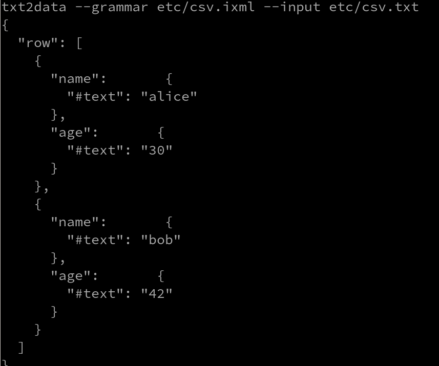
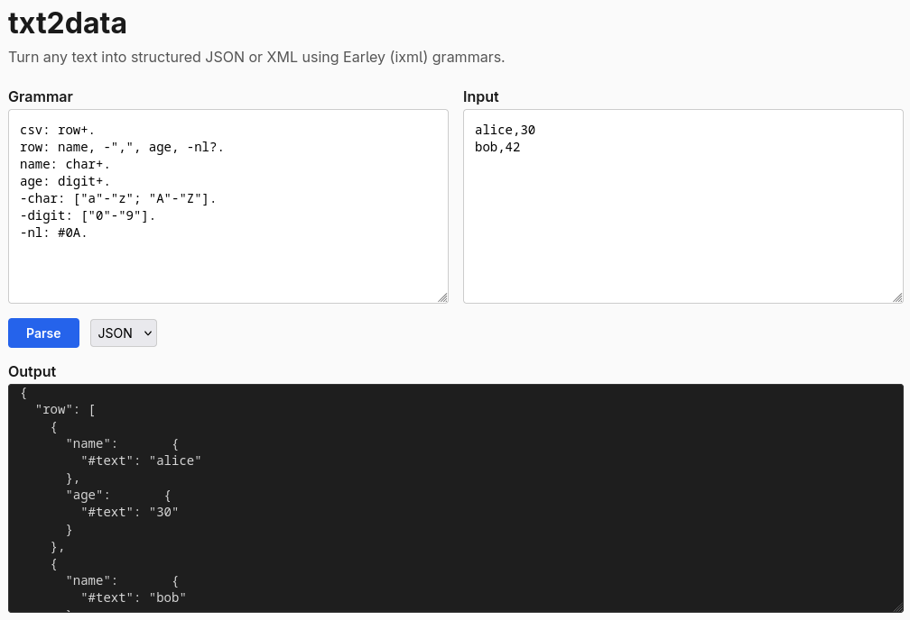

# txt2data

[](https://github.com/rh-jfuller/txt2data/actions/workflows/ci.yml)
[](https://github.com/rh-jfuller/txt2data/actions/workflows/pages.yml)

Describe your text with a grammar. Get back JSON, XML, YAML, or SQL.

**[Try it in your browser](https://rh-jfuller.github.io/txt2data/)** -- no install needed.



```sh
printf 'alice,30' | txt2data -e '
  row: name, -",", age.
  name: ["a"-"z"]+.
  age:  ["0"-"9"]+.
'
```

```json
{ "name": { "#text": "alice" }, "age": { "#text": "30" } }
```

No codegen, no build step -- just a grammar and your input.

## Install

```sh
cargo install txt2data
```

From source:

```sh
git clone https://github.com/rh-jfuller/txt2data && cd txt2data
make release && make install
```

## Usage

```sh
printf 'foo=bar' | txt2data -e 'pair: key, -"=", value. key: ["a"-"z"]+. value: ["a"-"z"]+.'
txt2data -g format.ixml -i data.txt
txt2data -g format.ixml -i data.txt -f xml
```

### As a library

```rust
use txt2data::parse_to_json;

let grammar = r#"
    row: name, -",", age.
    name: ["a"-"z"]+.
    age:  ["0"-"9"]+.
"#;

let json = parse_to_json(grammar, "alice,30").unwrap();
```

## Grammar

Rules: `name: definition.`

| Syntax      | Meaning               |
|-------------|-----------------------|
| `"text"`    | Literal               |
| `["a"-"z"]` | Character range       |
| `["abc"]`   | Character set         |
| `[Ll]`      | Unicode category      |
| `~[" "]`    | Exclusion             |
| `a, b`      | Sequence              |
| `a; b`      | Alternative           |
| `x+`        | One or more           |
| `x*`        | Zero or more          |
| `x?`        | Optional              |
| `-x`        | Hidden (omit output)  |
| `@x`        | Attribute (flat text) |
| `+"text"`   | Insertion             |
| `#0A`       | Hex codepoint         |

### Marks

Control output shape:

| Mark   | Effect                               |
|--------|--------------------------------------|
| (none) | Nested object / element              |
| `-`    | Hidden; children promoted up         |
| `@`    | Flat string property / XML attribute |
| `^`    | Explicitly an element                |

```sh
printf 'width:100px' | txt2data -e '
  decl: @prop, -":", @val.
  @prop: ["a"-"z"]+.
  @val: ["a"-"z"; "0"-"9"]+.
'
```

```json
{ "@prop": "width", "@val": "100px" }
```

## Output formats

**JSON** (default)

```json
{
  "row": [
    { "name": { "#text": "alice" }, "age": { "#text": "30" } },
    { "name": { "#text": "bob" },   "age": { "#text": "42" } }
  ]
}
```

**YAML** `-f yaml`

```yaml
---
row:
  name: alice
  age: 30
```

**XML** `-f xml`

```xml
<?xml version="1.0" encoding="UTF-8"?>
<row>
  <name>alice</name>
  <age>30</age>
</row>
```

**SQL** `-f sql`

```sql
INSERT INTO "csv" ("name", "age") VALUES ('alice', '30');
INSERT INTO "csv" ("name", "age") VALUES ('bob', '42');
```

## How it works

1. **Parse** -- recursive descent on ixml notation
2. **Normalize** -- desugar `+`/`*`/`?` into BNF
3. **Earley parse** -- handles any context-free grammar
4. **Extract tree** -- greedy iteration + memoized backtracking
5. **Serialize** -- emit JSON, XML, YAML, or SQL

Grammar notation: [Invisible XML](https://invisiblexml.org/), a W3C community spec.

## WASM

Compiles to WebAssembly.
**[Live demo](https://rh-jfuller.github.io/txt2data/)**

```sh
make serve   # build + local server on :8080
```

```js
import init, { wasm_parse_to_json } from './pkg/txt2data.js';
await init();
const json = wasm_parse_to_json(grammar, input);
```



## CLI reference

```
txt2data [OPTIONS]

  -g, --grammar <FILE>    Grammar file
  -e, --expr <GRAMMAR>    Inline grammar
  -i, --input <FILE>      Input file (default: stdin)
  -f, --format <FORMAT>   json (default), xml, yaml, sql
  -h, --help
  -V, --version
```

### Environment variables

| Variable | Default | Description |
|----------|---------|-------------|
| `TXT2DATA_MAX_GRAMMAR` | `1048576` (1 MB) | Max grammar size in bytes |
| `TXT2DATA_MAX_INPUT` | `10485760` (10 MB) | Max input size in bytes |

```sh
TXT2DATA_MAX_INPUT=52428800 txt2data -g big.ixml -i huge.txt
```

## Make targets

```
make build       # debug build
make release     # optimized build
make check       # fmt + clippy + test
make test        # cargo test
make examples    # run all etc/ examples
make wasm        # build wasm pkg
make serve       # wasm + local server on :8080
make install     # cargo install
```

## Known limitations

- **Performance** -- not yet optimized
- **Separated repetition** (`f++sep`) -- separator parsed but ignored
- **Parenthesized groups** with multiple alts produce a placeholder
- **Ambiguity** -- picks one parse, no alternatives reported

## Related

- [earleybird](https://github.com/mdubinko/earleybird) -- Rust ixml, full 890/890 conformance
- [rustixml](https://crates.io/crates/rustixml) -- Rust ixml with WASM
- [ixml spec](https://invisiblexml.org/ixml-specification.html)

## License

[MIT](LICENSE)
